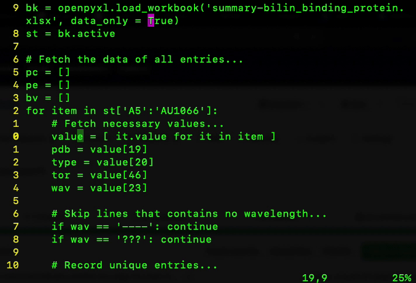

# Alignchar -- align text according to an input character

When I code, I always want to line up variable assignments by the `=` sign.
With `alignchar`, I can.  

## Installation

* Download the repository: `git clone https://github.com/carbonscott/vim-alignchar`
* Place it in a path where you keep your vim plugins, e.g. `$HOME/.vim/plugins` 
* Include the following line of code in your `.vimrc`: 
  `source $HOME/.vim/plugins/vim-alignchar/alignchar.vim`

## Usage

* Decide which character to align, and place the cursor at the column where the left most character to algin is.  For example, we want to align five `=` signs shown in the following image. 

* `<ctrl>-v` to start **VISUAL BLOCK** mode, and move your cursor across the lines that have the character to align.  Then, stay in the **VISUAL BLOCK** mode.  

* Make sure you are still in the **VISUAL BLOCK** mode, type `[a` to trigger a prompt at the lower left corner, asking which character to align.  

* Type the character to align and `<Enter>`.  For example, type `=` and all five `=` signs will be aligned at the same column.  

